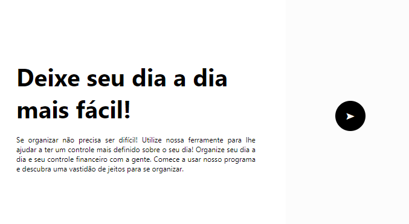
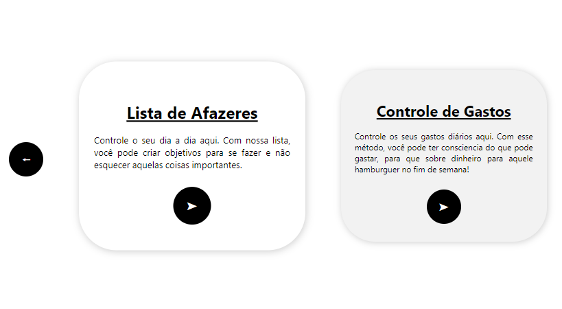
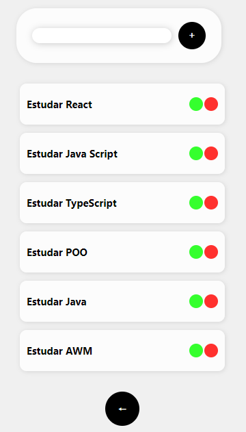

# ⛅| Lista de Tarefas

 <p> Uma lista de tarefas para que você possa anotar o que vocÊ tem para fazer no seu dia e encaixar cada um na sua rotina e se tornar mais produtivo! Com o sistema de financeiro, você pode também gerenciar algumas finanças suas e saber onde o seu dinheiro está sendo investido. </b></p>

## Indice
- [Funcionaldiade do projeto](#Funcionalidade-do-projeto)
- [UI](#UI)
- [Executar projeto](#Como-rodar)
- [Tecnologias utilizadas](#Tecnologias-utilizadas)
- [Autor](#Autor)
- [Atualizações Futuras](#Atualizações-futuras)

## Funcionalidade do projeto

- [x] Criar lembretes para o seu dia a dia
- [x] Adicionar e remover tarefas
- [x] Averiguar despesas diárias

## UI
<div align = "center">
    
    
    
</div>

<br>

## Como rodar o projeto

```bash
# Clone este repositório
$ git clone https://github.com/jefolidev/TodoList.git

# Acesse a pasta do proejeto no terminal
# cd todolist-financeiro

# Instale todas dependências
$ npm insall

# Execute a aplicação
```

## Tecnologias utilizadas 
<div align = center>

</div>

## Autor
<div align = center>
 
 <p> <b> Jeferson Franco, Desenvolvedor Full Stack </b> </p> 
 <a style = "text-decoration: none;" href = "https://www.linkedin.com/in/jeferson-franco-1349062b0/">  </a>
 <a style = "text-decoration: none;" href = "https://github.com/jefolidev">  </a>
</div>


## Atualizações futuras
- Adicionar uma seleção de temas para ficar do agrado de todos usuários;
- Aperfeiçoar a UI da lista, tendo em vista que não está refinada;
- Melhorar o código para que o botão não fique achatado assim que supera a quantidade de tasks;
- Adicionar um filtro para quando a task estiver finalizada;
- Adicionar o controle de gastos.
